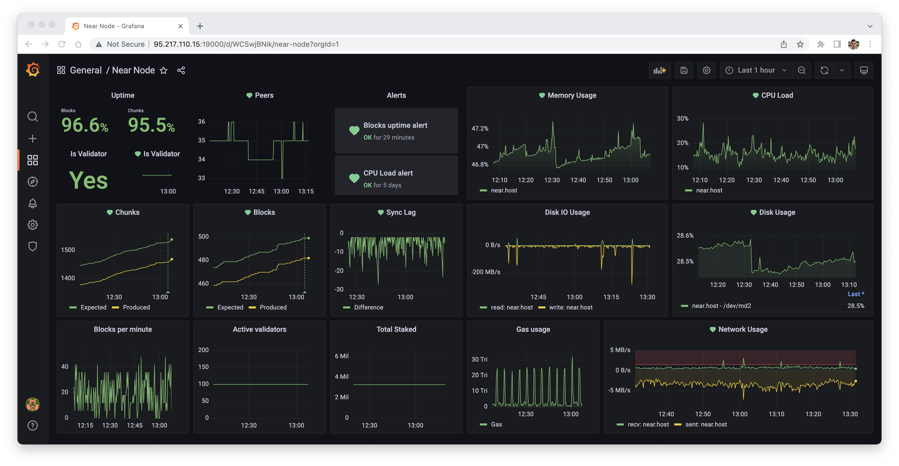

# near-protocol-node-monitoring
A monitoring tool based on Grafana + Prometheus for Near Protocol Node



# Setup

### Follow this guides to install docker engine and docker compose:
- https://docs.docker.com/desktop/install/linux-install/
- https://docs.docker.com/compose/install/

### Copy .env.example to .env
```sh
cp .env.example .env
```

### Fill script parameters in .env file
- **GRAFANA_ADMIN_USER** - Grafana admin user name
- **GRAFANA_ADMIN_PASSWORD** - Grafana admin password name

### Start
```sh
./start.sh
```

### Stop
```sh
./stop.sh
```

### Open Grafana
- Grafana will be available on `http://{Host.IP}:19000`

### Import dashboards
- Click on [+] -> Dashboard -> Upload JSON file
- Select file from `./grafana/dashboards/`
- Repeat for every file in `./grafana/dashboards/`

### Setup alerts channel
- Replace `klesh.factory.shardnet.near` to your `stacking_pool_id` for every panel in `Near Node Alerts` dashboard
- Got to Alerting > Notification channels > Add channel > Add desired channel

# Stake Wars: Episode III. Challenge 004
https://github.com/near/stakewars-iii/blob/main/challenges/004.md

